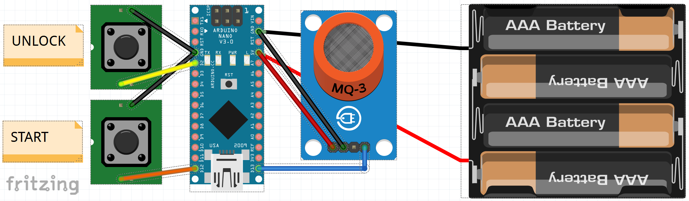

# low-BAC
This is an IoT project that helps ensure you have a low BAC (Blood Alcohol Content) reading before unlocking or starting your vehicle.  The idea is that this device would replace your key dongle.

## How it works
- The Arduino Nano 33 IoT runs the [low-bac.ino](./arduino/low-bac.ino) firmware which sends information to the Arudino Cloud.
- The Arduino Cloud has a dashboard but it also is configured with a webhook to script.google.com that runs our [proxy.gs](./script.google.com/Proxy.gs)
- The Proxy.gs file encodes the request and forwards it on to the ngrok server at https://jamisoncreations.ngrok.io/webhook
- The ngrok server forward the request to http://localhost:8080/webhook
- Our Node.js Express server is listening for requests on http://localhost:8080
- When a request to localhost:8080 for webhook gets invoked we:
  - Decode the body of the message
  - Print out information about the request (webhook id, thing id, and a list of name, value, timestamps) to the console
  - See if the _doorLocks_ variable is set to false (e.g. unlock).  If so:
    - Send a POST request to unlock the door
    - Send a GET request to get status of unlocking
    - If the status is PENDINGRESPONSE then retry the GET call
    - Print the response
  - See if the _startVehicle_ variable is set to true (e.g. start the vehicle).  If so:
    - Send a POST request to start the vehicle
    - Send a GET request to get status of starting the vehicle
    - If the status is PENDINGRESPONSE then retry the GET call
    - Print the response


## Wiring diagram


## Node Server Setup
This project requires you have [Node.js](https://nodejs.org/en/download/) and npm installed.  This version was developed and testing using Node version 15.5.1, npm 7.17.0 and Windows 10 (19042.1052).  You can check your versions by using the following command:
```
node --version
npm install npm@latest -g
npm --version
winver
```

Download the code to your local computer.  You can either clone the [repository](https://github.com/jamisonderek/low-BAC), or from the github repository click on the Code button and choose Download ZIP (which you can then extract into some folder on your local computer.)

To install the projects dependencies make sure you are in the same directory as the package.json file and then type the following command:
```
npm ci
```
When it finishes you should have a folder called node_modules with a couple hundred directories in it.

The above steps only need to be performed one time, however running the _npm ci_ command multiple times will not hurt anything.

## Environment variables
|variable|example value|default value|notes|
|--------|-------------|-------------|-----|
FORD_CLIENTSECRET|T_SuperSecret123|(See postman environment variables)|**Required.** Secret used to authenticate to the FordConnect API servers provided by Ford.
FORD_REFERSH|eySomething|(none)|**Required.** Set to your refresh_token (or set FORD_CODE if you prefer to use the auth code).
FORD_CODE|CODE1234-1234-1234|(none)|Optional. You can copy the value from your auth login page, the part after (https://localhost:3000/state=123&code=)
LOWBAC_HTTPPORT|8080|8080|Optional. The HTTP port that the service will listen on.


## Running the service
Make sure you set the required [environment variables](#environment-variables).

You can start the service using
```
node app
```

You then need to run the ngrok service.  You can use [ngrok](https://dashboard.ngrok.com/get-started/setup) to expose your localhost address on the internet.  Install [ngrok](https://dashboard.ngrok.com/get-started/setup) then run the following (if you set MYFORD_HTTPPORT use that value instead of 8000):
```
ngrok http 8080
```
Ngrok will display a bunch of information.  You will see a _Forwarding https address_ like "https://f00d0bad0042.ngrok.io" which is your ngrok domain.<p>
**NOTE:** This domain will change every time you reset ngrok if you are on the free plan, which means
you will need to update and [redeploy the script](#deploying-the-script)

## Deploying the script
- Navigate to https://script.google.com/home
- Click on "New Project"
- Change "Untitled project" to "FordConnect Hack"
- Replace all of the code with the contents of [./script.google.com/Proxy.gs](./script.google.com/Proxy.gs)
- change the "const webhookUri" entry from jamisoncreations.ngrok.io to your ngrok domain value. 
- Click "Deploy"
- Choose "New deployment"
- Click the Gear icon next to "Select type" and choose "Web app"
- In the description type "FordConnect v1.0"
- In the execute as choose "me"
- In the who has access choose "anyone"
- Click Deploy
- Copy the resulting Web app url.

## Create a "Thing" in Arduino
- Navigate to https://create.arduino.cc/iot/things
- Click on "Create thing"
- Click "Add" in the variables section.
  - Add a new bloodAlcoholContent variable 
    - name: bloodAlcoholContent
    - variable type: Floating point number
    - permissions: read & write
    - update: on change
  - Add a new doorLocks variable 
    - name: doorLocks
    - variable type: Boolean
    - permissions: read & write
    - update: on change
  - Add a new startVehicle variable
    - name: doorLocks
    - variable type: Boolean
    - permissions: read & write
    - update: on change
  - Add a new messages variable 
    - name: messages
    - variable type: Character string
    - permissions: read & write
    - update: on change
- In the Devices section click on "Select Device" then choose your "Arduino Nano 33 IoT" device.  I gave my device the name Cinnamon. 
- In the Network section click on Configure
  - Enter the SSID
  - Enter the password
- At the bottom of the the page click on "Set webhook"
  - In the webhook url, copy the Web app url from the last step of the [deploying the script](#deploying-the-script) section.
  - Click "Set webhook"
  - Click "X" to close the dialog.
- In the Sketch tab replace the contents with the contents from [./arduino/low-bac.ino](./arduino/low-bac.ino) but keep line three the same as the original; https://create.arduino.cc/cloud/things/...yourid...
- You can click on "Open full editor" to see the other associated files.

## Create a "Dashboard" in Arduino
- Navigate to https://create.arduino.cc/iot/dashboards
- Click "Build dashboard"
- Change the name from "Untitled" to "BAC"
- Click on the edit (pencil) icon.
- Add a BAC meter
  - Click on the "Add" button
  - Choose a "Gauge"
  - Change the name to "BAC"
  - Click on "Link variable" and choose bloodAlcholContent
  - Change the max value to "0.500" (or whatever you think is more than you will ever need.)
- Add a Locked switch
  - Click on the "Add" button
  - Choose a "Switch"
  - Change the name to "Locked"
  - click on "Link variable" and choose doorLocks
  - Turn off "Show ON/OFF labels"
- Add a Started vehicle status
  - Click on the "Add" button
  - Choose a "Status"
  - Change the name to "Started vehicle"
  - Click on "Link variable" and choose "startVehicle"
- Add a Messenger control
  - Click on the "Add" button
  - Choose a "Messenger"
  - Change the name to "Output"
  - click on "Link variable" and choose "messages"
- Click on the double arrow icon and Arrange the widgets on the dashboard to your liking.

